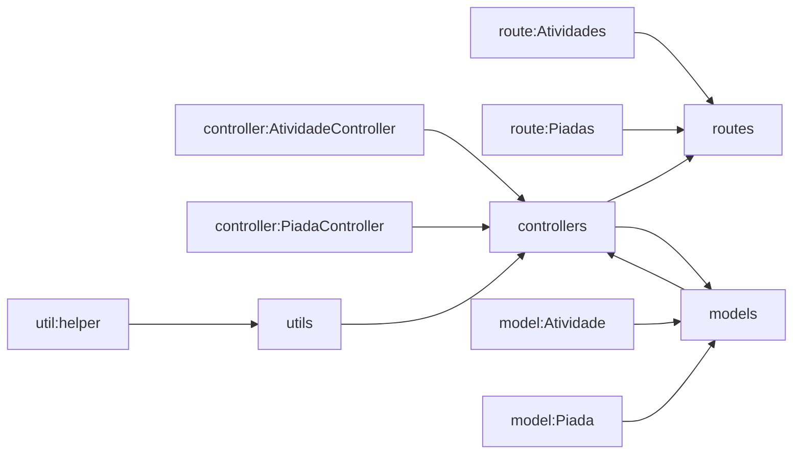

# Avaliação Sprint 4 - Equipe 3

Avaliação da quarta sprint do programa de bolsas Compass UOL para formação em machine learning para AWS.

## Integrantes da Equipe 3
* Matheus Henrique Rodrigues da Costa 
* Luiz Paulo Grafetti Terres
* Fabiano Souza Mendonça
* Josue de Mendonça Fernandes

***
## Descrição do Projeto

A aplicação comporta-se como uma API que consome outras duas APIs, sendo essas:

| API   |      URL      |  ROUTE (GET) |
|----------|:-------------:|:------|
| The Bored API | https://www.boredapi.com | /api/activity/ |
| chucknorris.io | https://api.chucknorris.io | /jokes/random |

Além de uma rota raiz de breve descrição do projeto, para cada uma das APIs, o projeto disponibiliza duas rotas (uma para cada API original) com os conteúdos de cada api, formatados de acordo com o que foi solicitado pela descrição da atividade. Entenda melhor sobre as rotas:

|    ROUTES       |
|:------|
| http://34.203.123.155/|
| http://34.203.123.155/api/piadas |
| http://34.203.123.155/api/atividades |

* para todas as rotas, o status code para sucesso da requisição será `200`
* e para falha na requisição será `404` com uma mensagem `err` de erro na requisição.

### Rota → Get /

1. Essa rota direciona para a página principal da aplicação, que exibe uma mensagem simples:

```
Este é o app do Grupo 3 😀
```

### Rota → Get /api/piadas

1. O retorno da API é apresentado na seguinte formatação:

#### Exemplo de retorno da Rota:
```json
{
  "data_atualizacao": "05-01-2020",
  "data_criacao": "05-01-2020",
  "icone": "https://assets.chucknorris.host/img/avatar/chuck-norris.png",
  "id": "b7585687-b14b-406d-a557-9cfeea4a8c16",
  "piada": "CHUCK NORRIS can slit your throat with his pinkie toenail.",
  "referencia": "https://api.chucknorris.io/jokes/2itjvbXZTcScUiuAMoOPLA"
}
```

#### Observações sobre os campos do retorno

- `data_atualizacao` → o campo “updated_at” da resposta da API original.
  - Formatação: data no formato DD/MM/AAAA

- `data_criacao` → o campo “created_at” da resposta da API original.  
  - Formatação: data no formato DD/MM/AAAA

- `icone` → o campo “icon_url” da resposta da API original.  

- `id` → GUID gerado randomicamente

- `piada` → o campo “value” da resposta da API original. 

- `referencia` → será o campo “url” da resposta da API original.  


### Rota → Get /api/atividades

1. O retorno da API é apresentado na seguinte formatação:

#### Exemplo de retorno da Rota:
```json
{
  "id": "b7585687-b14b-406d-a557-9cfeea4a8c16",
  "atividade": "Wash your car",
  "tipo": "busywork",
  "participantes": 1,
  "acessibilidade": "15%"
}
```

#### Observações sobre os campos do retorno

- `id` → GUID gerado randomicamente

- `atividade` → o campo “activity” da resposta da API original.  

- `tipo` → o campo “type” da resposta da API original.  

- `participantes` → o campo “participants” da resposta da API original.  

- `acessibilidade` → o campo “accessibility” da resposta da API original.  
  - Formatação: número percentual dentro de uma string.

***

## Observações sobre deploy na AWS utilizando o Elastic Beanstalk

O deploy da aplicação foi efetuado por meio do serviço Elastic Beanstalk da AWS. Mais informações sobre o Elastic Beanstalk podem ser encontradas na [documentação da AWS](https://docs.aws.amazon.com/pt_br/elasticbeanstalk/latest/dg/Welcome.html)

Arquitetura do projeto na AWS:


***
### Arquitetura do Projeto
1. Para organização do codigo foi utilizado o modelo MVC. Entretanto, para esta atividade, não foram criadas _views_, sendo assim, 
o _controller_ formata os dados atraves dos _models_ e encaminha os dados formatados de volta a rota.



2. Estrutura de Pastas do projeto:

- **src**
  - **config**
    - ```.example.env``` 
  - **controllers**
    - ```AtividadeController.js```
    - ```PiadaController.js```
  - **models**
    - ```Atividade.js```
    - ```Piada.js```
  - **routes**
    - ```Atividade.js```
    - ```Piada.js```
  - **utils**
    - `helper.js`
  - `index.js`

***

## Dificuldades Encontradas

- Contratempos para deploy no AWS Elastic Beanstalk.

***

## Licença
Internet Systems Consortium license

Copyright (c) 2023, Equipe-3

É concedida permissão para usar, copiar, modificar e/ou distribuir este software para qualquer finalidade, com ou sem taxa, desde que o aviso de direitos autorais acima e este aviso de permissão apareçam em todas as cópias.