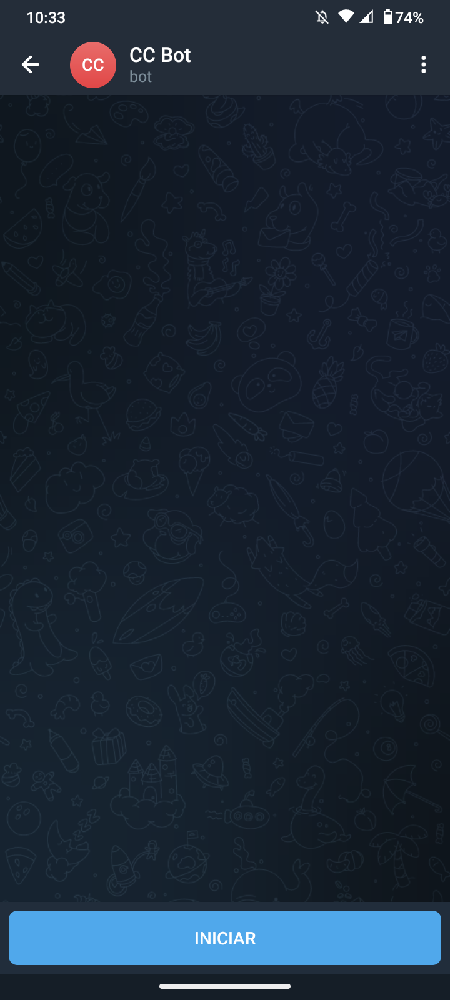
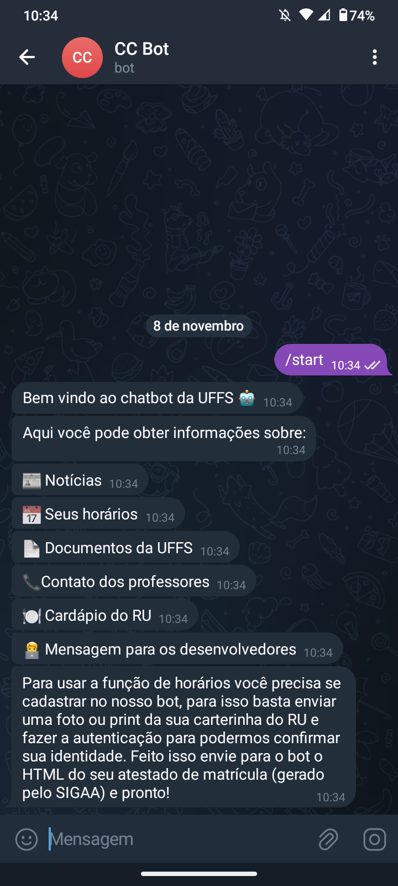
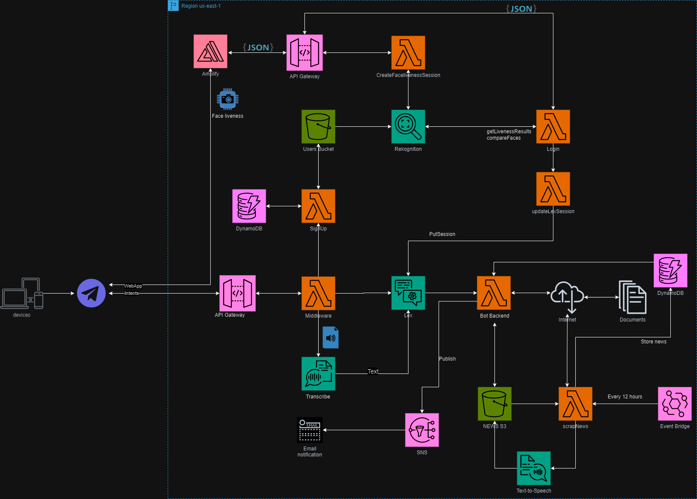

# CC BOT


## Integrantes

<a href="https://github.com/FabianoMendonca"></a>

<a href="https://github.com/Gregory-JP"></a>

<a href="https://github.com/joaowinderfeldbussolotto"></a>

<a href="https://github.com/luizpgt"></a>

<a href="https://github.com/matth3wss"></a>

<a href="https://github.com/Paulocc"></a>


## Sumário

- [1 - Descrição do Projeto](#desc)
- [2 - Funcionalidades](#func)
- [3 - Desenvolvimento do Projeto](#desproj)
- [4 - Utilização do Bot](#utliz)
- [5 - Estrutura de Pastas do Projeto](#estrpast)
- [6 - Dificuldades Conhecidas](#dific)
- [7 - Arquitetura AWS](#aaws)


<a id="desc"></a>

## Descrição do Projeto

Bem-vindo ao **CC BOT**, a sua inovadora assistência em comunicação para o curso de Ciência da Computação na UFFS! Nosso maior objetivo é proporcionar um portal de informações para calouros e alunos interessados. No **CC BOT**, nossa missão é levar informações sobre o curso de Ciência da Computação da UFFS a todos os alunos, de maneira acessível e inclusiva.

Todas as informações estarão sendo retiradas dos sites oficiais do curso da universidade.

<a id="func"></a>

## Funcionalidades

**1. Contatos:**

Precisa do e-mail de um professor? **CC BOT** tem todas as informações prontas para você. Seja para dúvidas acadêmicas ou questões específicas sobre o curso, estamos aqui para conectar você aos professores, técnicos, servidores e departamentos.

**2. Cardápio do RU:**

Mantenha-se atualizado com as opções diárias do Restaurante Universitário (RU). **CC BOT** fornece o cardápio de forma clara e rápida, para que você possa planejar suas refeições com facilidade.

**3. Notícias em Áudio:**

Fique por dentro das últimas notícias do curso. **CC BOT** oferece uma experiência única, apresentando notícias relevantes em formato de áudio para tornar a sua experiência ainda mais acessível.

**4. Horários:**

Precisa saber os dias ou horários das aulas, e os professores ministrantes? **CC BOT** está aqui para fornecer informações atualizadas sobre os horários, garantindo que você esteja sempre no lugar certo, na hora certa.

**5. Documentos:**

Explore a grade curricular do curso, consulte facilmente os pré-requisitos necessários para cada disciplina, ou o que tiver interesse. **CC BOT** está aqui para tornar a navegação entre os documentos oficiais uma experiência simplificada.

<a id="desproj"></a>

## Desenvolvimento do Projeto

O **CCBot** foi desenvolvido usando recursos disponibilizados pela Amazon Web Services (AWS) tais como, Amazon Lex, Polly, Rekognition, SNS, DyanamoDB e S3. <br>
O deploy foi feito utilizando a arquiterura serverless e também Terraform, já a integração foi realizada na plataforma do Telegram.

- **Amazon Lex**: serviço utilizado para o desenvolvimento do chatbot.
- **Polly**: foi utilizado o serviço de Text-to-Speech (TTS) para transformar as notícias em áudio.
- **Rekognition**: foi utilizado o serviço de Face Liveness para permitir a autenticação do usuário no bot.
- **Simple Notification Service (SNS)**: serviço de envio de mensagens, foi utilizado para que o usuário possa mandar mensagens para os desenvolvedores.
- **DynamoDB**: banco de dados NoSQL disponibilizado pela AWS, é onde armazenamos os dados dos usuários cadastrados no bot.
- **S3**: foi utilizado para armazenar os áudios das notícias gerados pelo Polly, armazena também as fotos dos usuários.

<a id="utliz"></a>

## Utilização do Bot

Para utlizar o **CCBot** você precisa criar uma conta no Telegram, caso não tenha uma. Após isso pesquise por ```@CC_UFFS_Bot```, dentro da conversa com o bot, digite o comando ```ajuda``` para instruções e funcionalidades mais detalhadas. Ou leia o **QRcode** abaixo e abra o link para iniciar a conversa.

<div align="center">


</div>

Ao abrir o link você será redirecionando ao telegram, aperte em iniciar para começar a conversa com o bot.


<div align="center">




</div>

<a id="estrpast"></a>

## Estrutura de Pastas do Projeto

```
└── src
  └── assets
    └── diagam-aws.png
  
  └── bot-lex-v2-backend
    ├── controllers
      ├── contact_controller.py
      ├── contact_us_controller.py
      ├── documents_controller.py
      ├── news_controller.py
      ├── ru_menu_controller.py
      └── schedule_controller.py
    ├── core
      └── config.py
    ├── handlers
      ├── contact.py
      ├── contact_us.py
      ├── documents.py
      ├── news.py
      ├── ru_menu.py
      └── update_lex_session.py
    ├── middleware
      ├── requests.py
      ├── telegramToLex.py
      └── text.py
    ├── services
      ├── dynamo.py
      ├── lex_service.py
      ├── polly.py
      └── sns.py
    ├── utils.py
    └── web_scraping
      ├── contact_scraping.py
      ├── documents_scraping.py
      ├── news_scraping.py
      └── schedule.py
  
  └── face-liveness-service
    ├── backend
      ├── authenticate.py
      ├── config.py
      ├── create_liveness_session.py
      ├── exceptions
        ├── auth_exception.py
        ├── aws_exceptions
          └── rekognition_exception.py
        └── base_exception.py
      ├── s3_cleanup.py
      ├── services
        ├── bucket_service.py
        ├── dynamodb_service.py
        └── rekognition_service.py
      ├── sign_in.py
      ├── token_expiration_check.py
      └── utils.py
    └── frontend
      ├── public
        ├── favicon.ico
        ├── index.html
        ├── logo192.png
        ├── logo512.png
        ├── manifest.json
        └── robots.txt
      └── src
        ├── App.css
        ├── App.js
        ├── App.test.js
        ├── Components
          ├── FaceLiveness.js
          ├── ReferenceImage.js
          └── ResultPage.js
        ├── index.css
        ├── index.js
        └── logo.svg
  
  └── terraform
    ├── bucket.tf
    ├── dynamodb-table.tf
    ├── main.tf
    ├── sns.tf
    ├── tags.tf
    ├── terraform.tfvars
    ├── terraform.tfvars.example
    └── variables.tf
```

<a id="dific"></a>

## Dificuldades Enfrentadas pela Equipe

- Integrar diferentes serviçoes para deixar o login transparente ao usuário;
- Tratamento de arquivos binários pelo API Gateway;
- Utilização da biblioteca de face liveness (só tem em React e o time não possui conhecimento sobre o framework);
- Mapear os erros nas chamadas das intents;
- Criação do orquestrador para fazer a comunicação do telegram com o lex;

<a id="aaws"></a>

## Arquitetura AWS


